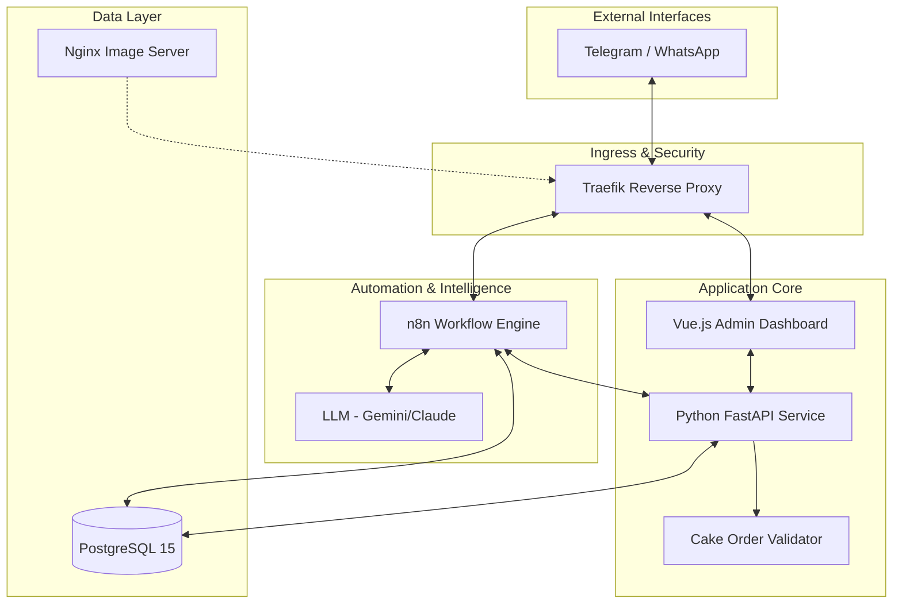

# 🎂 Custom Cake Order Manager

[](https://fastapi.tiangolo.com/)
[](https://vuejs.org/)
[](https://n8n.io/)
[](https://www.postgresql.org/)
[](https://www.docker.com/)

A specialized order management system designed for custom bakeries to automate the intake of complex cake orders through conversational interfaces. It solves the problem of high-friction data collection for bespoke products by using AI to extract structured requirements from natural language chat (Telegram/WhatsApp), while enforcing strict culinary business rules (e.g., structural stability for tiered cakes) through a dedicated validation engine.

---

## 🏗️ Architecture



---

## 🛠️ Tech Stack

| Component | Technology | Purpose |
| :--- | :--- | :--- |
| **Reverse Proxy** | **Traefik** | TLS termination, path-based routing, and service discovery (`docker-compose.yml`). |
| **Automation** | **n8n** | Orchestrates chat webhooks, LLM prompting, and database persistence (`n8n/flows`). |
| **Backend API** | **Python (FastAPI)** | High-performance API for order validation and business logic (`python_app/app.py`). |
| **Frontend** | **Vue.js 3 (Vite)** | Admin dashboard for chat monitoring and order review (`custom_cake_frontend`). |
| **Database** | **PostgreSQL 15** | Relational storage for orders, sessions, and configuration (`postgres/postgres-init`). |
| **State Management** | **Pinia** | Frontend reactive state management (`custom_cake_frontend/package.json`). |
| **Orchestration** | **Docker Compose** | Multi-container deployment and environment isolation (`docker-compose.yml`). |

---

## 📂 Project Structure

```text
.
├── docker-compose.yml           # Multi-service container orchestration
├── custom_cake_frontend/        # Vue.js admin dashboard
│   ├── src/views/ChatView.vue   # Live chat monitoring interface
│   └── src/services/api.ts      # Axios client for backend communication
├── n8n/                         # Automation workflows and configuration
│   └── n8n-workflows/           # Exported JSON workflows for chat processing
├── postgres/                    # Database initialization and schema
│   └── postgres-init/           # SQL scripts for tables and seed data
└── python_app/                  # Core business logic service
    ├── app.py                   # FastAPI entry point
    ├── handlers/                # API route definitions (cake_order_manager_handler.py)
    └── utils/                   # Order validation engine (cake_order_validator.py)
```

---

## 🚀 Quick Start

1.  **Clone & Enter**
    ```bash
    git clone https://github.com/your-repo/custom-cake-order-manager.git
    cd custom-cake-order-manager
    ```

2.  **Configure Environment**
    ```bash
    cp .env.example .env
    # Edit .env with your API keys and domain
    ```

3.  **Launch Stack**
    ```bash
    docker-compose up --build -d
    ```

4.  **Access Points**
    - **Frontend Dashboard:** `https://[your-domain]/custom-cake-manager`
    - **API Documentation:** `https://[your-domain]/api/docs`
    - **Database Admin:** `https://[your-domain]/adminer`

---

## ⚙️ How It Works

1.  **Ingestion:** A message from Telegram or WhatsApp hits the `n8n` webhook. The message is logged in the `chat_logs` table via n8n's database node (`04_00_custom_order_database.sql`, line 177).
2.  **Extraction:** n8n sends the message to an LLM node (Gemini/Claude) with a prompt guided by `order_config`. The LLM extracts fields like `flavor`, `tiers`, and `event_date`.
3.  **Validation:** n8n forwards the extracted JSON to the Python backend's `/api/cakeOrder/validate` endpoint (`python_app/handlers/cake_order_manager_handler.py`).
4.  **Rule Execution:** The `validate_cake_order` function in `python_app/utils/cake_order_validator.py` (line 104) iterates through `field_rules`.
5.  **Constraint Checking:** The `validate_rules` function (line 33) checks specific types like `lead_time` by comparing the `event_date` to `datetime.now()` plus `min_days`.
6.  **Persistence:** If valid, the state is updated in the `custom_orders` table. If invalid, specific error messages are returned to guide the customer.

---

## 🎯 Design Decisions

*   **Deterministic Validation:** Business rules (like `min_base_for_tiers` in `04_00_custom_order_database.sql`, line 214) are enforced in Python (`cake_order_validator.py`, line 45) rather than relying on LLM reasoning.
*   **Forward Auth via n8n:** Admin security is handled by Traefik's `forwardauth` middleware pointing to an n8n webhook (`docker-compose.yml`, line 135), centralizing authentication.
*   **Recursive Tier Sync:** The validator dynamically manages a `tier_definitions` array (`cake_order_validator.py`, line 161), automatically scaling nested objects as the number of tiers changes.
*   **SQL-Driven Config:** Extraction hints and metadata are stored in the `order_config` table (`04_00_custom_order_database.sql`, line 102), allowing non-technical updates to the menu.

---

## 🎓 What This Demonstrates

*   **Hybrid AI Architectures:** Combining non-deterministic LLM extraction with strict, testable Python business logic (`cake_order_validator.py`).
*   **Complex Data Modeling:** Relational schemas with JSONB support for dynamic specifications (`04_00_custom_order_database.sql`, line 56).
*   **Full-Stack Orchestration:** Multi-service containerized environment with automated networking and TLS (`docker-compose.yml`).
*   **Real-time Admin Tooling:** Reactive dashboards bridging bot flows and human intervention (`ChatView.vue`).

---

## ⚠️ Limitations

*   **Payment:** Tracks order intent but lacks integrated payment gateway processing; status is managed manually in `order_status` (`04_00_custom_order_database.sql`, line 42).
*   **Inventory:** Validates menu existence but does not perform real-time stock-level checks for specific dates.
*   **Vision:** Captures `image_reference` but does not yet employ computer vision to verify image-to-text consistency.
